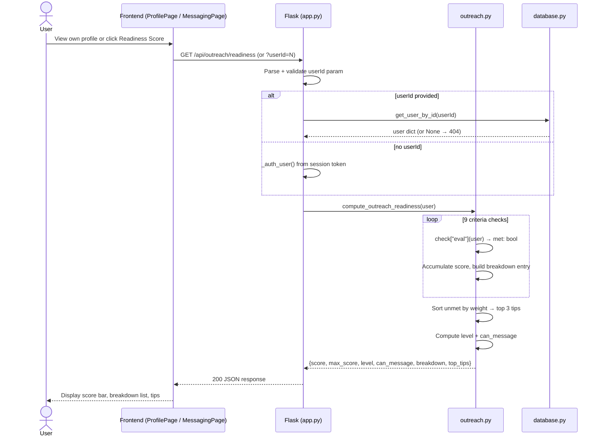
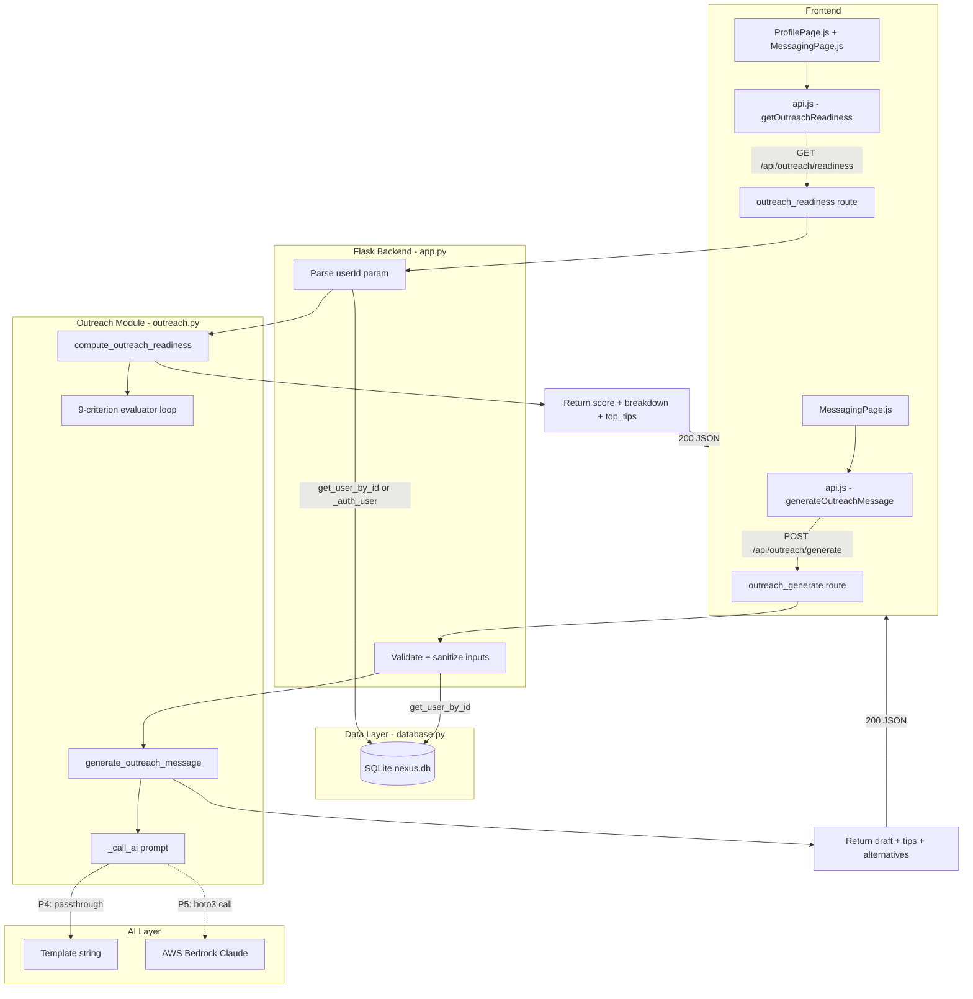
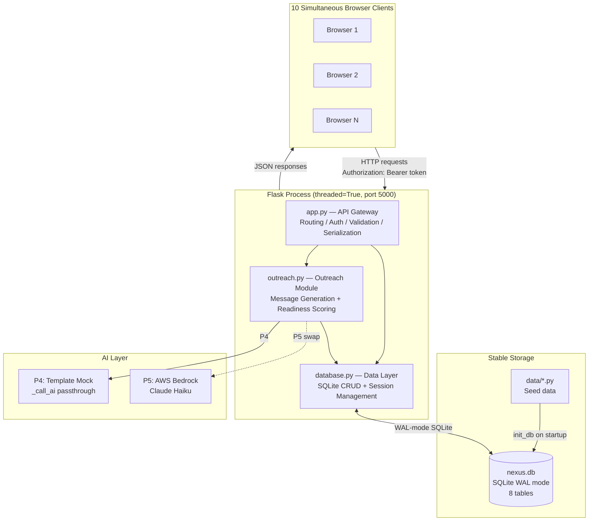
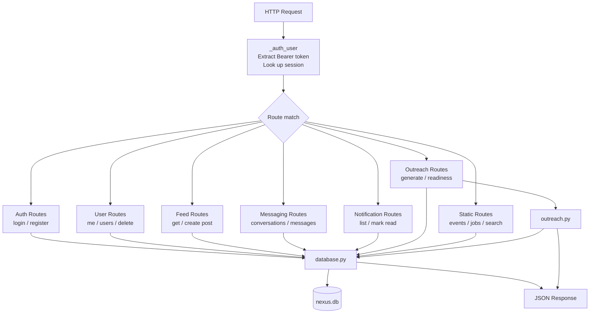
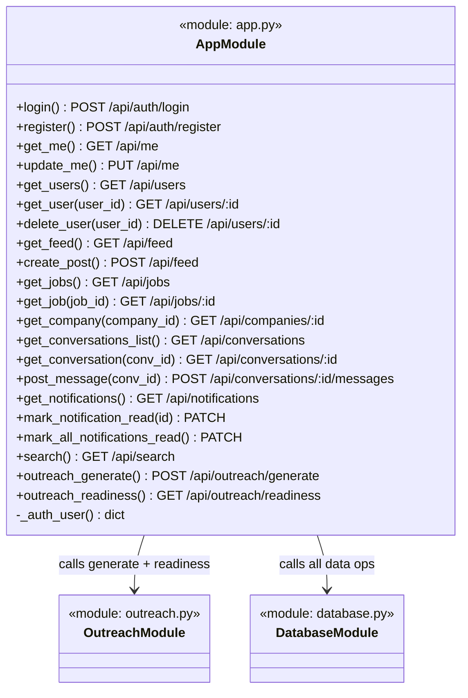
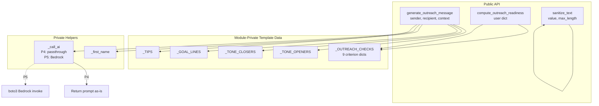
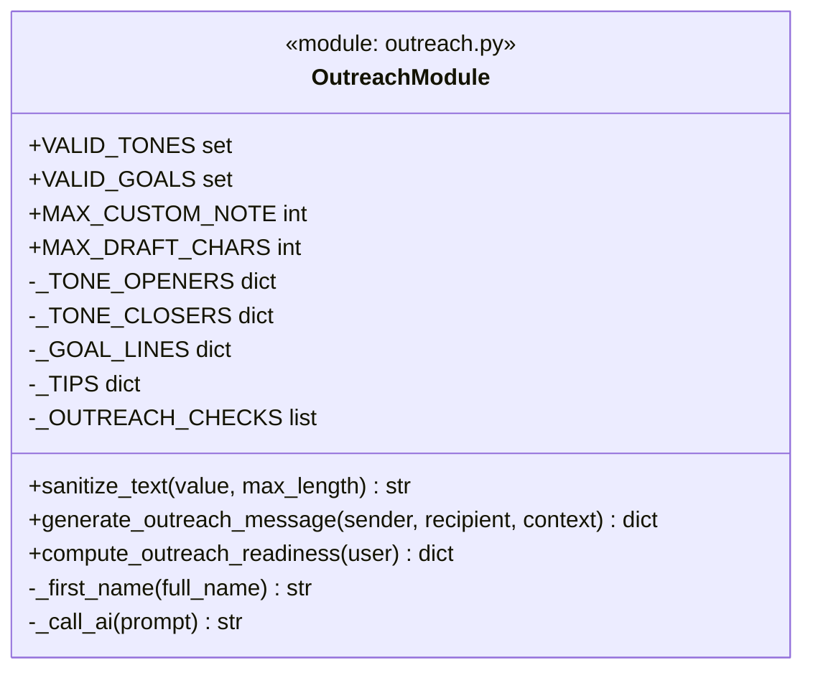
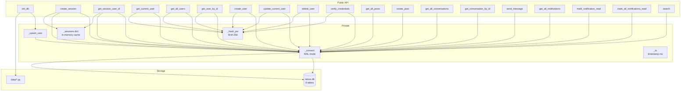
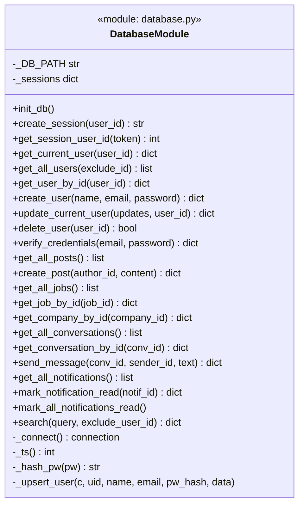

# P4: Backend Development — Nexus LinkedIn Redesign
**CS485 AI-Assisted Software Engineering — Spring 2026**
**Team: Krishi Shah, Dhyani Shah**

---

## Table of Contents

1. User Stories Implemented
2. Updated Development Specifications
3. Unified Backend Architecture
4. Backend Module Specifications
5. GitHub Links
6. Commands to Run the Application
7. Reflection
8. LLM Interaction Logs

---

## 1. User Stories Implemented

### Story #1 — Outreach Message Guidance (Independent)

> *As a student job seeker, I want help drafting my first LinkedIn message so that I feel confident reaching out to professionals without sounding awkward.*

**Source:** https://github.com/dhy-ani/linkedin-clone/issues/2

**Acceptance Criteria:**

| ID | Criterion |
|----|-----------|
| AC-1 | The system generates a personalized outreach message draft when the user selects a recipient and a goal |
| AC-2 | The user can choose a tone: Professional, Friendly, or Formal |
| AC-3 | The user can add a custom note that is incorporated into the draft |
| AC-4 | The generated draft is at most 500 characters |
| AC-5 | The system returns 2 alternative openers alongside the main draft |
| AC-6 | The system returns 3 actionable tips for the selected tone |
| AC-7 | If the recipient does not exist, the system returns a clear error |

---

### Story #2 — Outreach Readiness Check (Dependent on Story #1)

> *As a job seeker, I want feedback on my profile before messaging someone so that I present myself professionally.*

**Source:** https://github.com/dhy-ani/linkedin-clone/issues/3

**Acceptance Criteria:**

| ID | Criterion |
|----|-----------|
| AC-1 | The system scores a user's profile against 9 weighted criteria, max score 100 |
| AC-2 | The score is broken down by criterion, showing whether each was met |
| AC-3 | The system returns the top 3 unmet tips, ordered by weight (highest impact first) |
| AC-4 | The system returns `can_message: true` when score ≥ 60 |
| AC-5 | The level is `ready` (≥75), `almost_ready` (≥50), or `not_ready` (<50) |
| AC-6 | The score for any user can be retrieved by passing `?userId=<id>` |
| AC-7 | A non-existent userId returns a 404 error |

---

## 2. Updated Development Specifications

### 2.1 Harmonized Backend Overview

Both stories share a **single Flask backend process** with a **single SQLite database**. There are no redundant services, no separate processes per story, and no duplicate dependencies.

| Concern | Choice | Reason |
|---------|--------|--------|
| HTTP framework | Flask 3.0 | Lightweight, sufficient for 10 concurrent users |
| Database | SQLite 3 (WAL mode) | Zero-config, file-based, WAL allows concurrent reads |
| AI generation | Template mock (P4) / AWS Bedrock (P5) | Single swap point in `_call_ai()` |
| Auth | SHA-256 token in `sessions` table | No external auth dependency |
| CORS | flask-cors `origins: "*"` | Frontend served from file:// or different port |
| Concurrency | `threaded=True` + WAL | 10 simultaneous users, no queuing needed |

---

### 2.2 Development Spec — Story #1: Outreach Message Guidance

#### API Contract

**Endpoint:** `POST /api/outreach/generate`

**Request body:**
```json
{
  "recipientId": 5,
  "tone": "professional",
  "goal": "networking",
  "custom_note": "I loved your Config 2025 talk!",
  "details": {
    "yourRole": "CS student",
    "field": "machine learning",
    "company": "Google",
    "role": "SWE Intern",
    "context": "I saw your recent paper on transformers"
  }
}
```

| Field | Type | Default | Validation |
|-------|------|---------|------------|
| `recipientId` | integer | required | Must be positive integer; 400 if missing/invalid, 404 if not found |
| `tone` | string | `"professional"` | One of `professional`, `friendly`, `formal`; defaults to `professional` if invalid |
| `goal` | string | `"networking"` | One of `job_inquiry`, `networking`, `advice`, `collaboration` |
| `custom_note` | string | `""` | Truncated to 200 chars; HTML tags and control characters stripped |
| `details` | object | `{}` | Sub-fields truncated to 100 chars each |

**Response (200):**
```json
{
  "draft": "Hi Sarah,\n\nI hope this message finds you well...",
  "char_count": 312,
  "tone": "professional",
  "tips": [
    "Keep your message under 300 characters — shorter notes get a 3x higher reply rate.",
    "Mention a specific detail from their profile to show genuine interest.",
    "End with a low-commitment ask (e.g., 'Would you be open to a quick chat?')."
  ],
  "alternatives": [
    "Hi Sarah, I came across your work as Senior Engineer at Google and would love to connect.",
    "Hey Sarah — your background in ML really caught my attention!"
  ]
}
```

**Error responses:**

| Status | Condition |
|--------|-----------|
| 400 | Missing or invalid `recipientId` |
| 404 | `recipientId` not found in database |

#### Internal Logic (Pseudocode)

```
1. Parse and validate recipientId (must be positive integer)
2. Fetch recipient from database → 404 if not found
3. Sanitize tone, goal, custom_note, details (strip HTML + control chars, truncate)
4. Normalize tone → default "professional" if not in VALID_TONES
5. Normalize goal → default "networking" if not in VALID_GOALS
6. Build message body:
   a. Open with TONE_OPENERS[tone]
   b. Insert sender first name + optional role
   c. Insert GOAL_LINES[goal], enriched with details.field / details.company / details.role
   d. Append context and custom_note if provided
   e. Close with TONE_CLOSERS[tone]
7. Pass assembled body through _call_ai() → P4: returns as-is; P5: Bedrock
8. Truncate to MAX_DRAFT_CHARS (500)
9. Return { draft, char_count, tone, tips, alternatives }
```

#### P4 → P5 Upgrade Path

In P4, `_call_ai(prompt)` returns the assembled template string directly. In P5, replace only the body of `_call_ai()` with:

```python
import boto3, json

def _call_ai(prompt):
    client = boto3.client("bedrock-runtime", region_name="us-east-1")
    body = json.dumps({
        "anthropic_version": "bedrock-2023-05-31",
        "max_tokens": 200,
        "messages": [{"role": "user", "content": prompt}]
    })
    response = client.invoke_model(modelId="anthropic.claude-3-haiku-20240307-v1:0", body=body)
    return json.loads(response["body"].read())["content"][0]["text"]
```

No other code changes are required — the API contract, validation, and response shape stay identical.

**Estimated cost:** ~$0.0008 per 1,000 tokens (Claude Haiku on Bedrock). Negligible within $100–200 credit.

---

#### Story #1 Sequence Diagram

```mermaid
sequenceDiagram
    actor User
    participant FE as Frontend (api.js)
    participant Flask as Flask (app.py)
    participant Outreach as outreach.py
    participant DB as database.py
    participant AI as AI Mock / Bedrock

    User->>FE: Click "Generate" with recipientId, tone, goal, custom_note
    FE->>Flask: POST /api/outreach/generate
    Flask->>Flask: Validate recipientId (positive int)
    Flask->>DB: get_user_by_id(recipientId)
    DB-->>Flask: recipient dict (or None)
    Flask->>Flask: Sanitize tone, goal, custom_note, details
    Flask->>Outreach: generate_outreach_message(sender, recipient, context)
    Outreach->>Outreach: Build message body from templates + details
    Outreach->>AI: _call_ai(assembled_body)
    AI-->>Outreach: draft string (P4: passthrough; P5: Bedrock response)
    Outreach->>Outreach: Truncate to 500 chars, build tips + alternatives
    Outreach-->>Flask: {draft, char_count, tone, tips, alternatives}
    Flask-->>FE: 200 JSON response
    FE-->>User: Display draft in outreach panel
```

---

### 2.3 Development Spec — Story #2: Outreach Readiness Check

#### API Contract

**Endpoint:** `GET /api/outreach/readiness`
**Optional query param:** `?userId=<int>`

| Parameter | Type | Description |
|-----------|------|-------------|
| `userId` | integer (optional) | If omitted, scores the current authenticated user |

**Response (200):**
```json
{
  "score": 80,
  "max_score": 100,
  "level": "ready",
  "can_message": true,
  "breakdown": [
    { "key": "experience", "label": "Has at least one role", "weight": 20, "met": true, "tip": null },
    { "key": "headline",   "label": "Headline is descriptive", "weight": 15, "met": true, "tip": null },
    { "key": "skills",     "label": "5+ skills listed", "weight": 15, "met": true, "tip": null },
    { "key": "photo",      "label": "Profile photo present", "weight": 10, "met": true, "tip": null },
    { "key": "about",      "label": "About section filled in", "weight": 10, "met": false,
      "tip": "Write 100+ characters in your About section to tell your story." },
    { "key": "education",  "label": "Has education listed", "weight": 10, "met": true, "tip": null },
    { "key": "connections","label": "At least 10 connections", "weight": 10, "met": true, "tip": null },
    { "key": "open_to_work","label": "Open-to-work signal set", "weight": 5, "met": false,
      "tip": "Enable 'Open to Work' if you're job-hunting." },
    { "key": "website",    "label": "External link / portfolio", "weight": 5, "met": false,
      "tip": "Add a portfolio or GitHub link to stand out." }
  ],
  "top_tips": [
    "Write 100+ characters in your About section to tell your story.",
    "Enable 'Open to Work' if you're job-hunting.",
    "Add a portfolio or GitHub link to stand out."
  ]
}
```

**Scoring criteria (9 checks, total weight = 100):**

| Key | Label | Weight | Condition |
|-----|-------|--------|-----------|
| `experience` | Has at least one role | 20 | `len(experience) > 0` |
| `headline` | Headline is descriptive | 15 | headline has ≥ 5 words |
| `skills` | 5+ skills listed | 15 | `len(skills) >= 5` |
| `photo` | Profile photo present | 10 | `avatarColor` or `photo` is truthy |
| `about` | About section filled in | 10 | `len(about) >= 100` |
| `education` | Has education listed | 10 | `len(education) > 0` |
| `connections` | At least 10 connections | 10 | `connections >= 10` |
| `open_to_work` | Open-to-work signal set | 5 | `openToWork` is truthy |
| `website` | External link / portfolio | 5 | `website` is truthy |

**Error responses:**

| Status | Condition |
|--------|-----------|
| 400 | `userId` is not a positive integer |
| 404 | `userId` not found in database |

#### Internal Logic (Pseudocode)

```
1. Parse optional userId query parameter
   - If present: validate positive integer → 400 if invalid
   - Fetch user from DB → 404 if not found
   - If absent: use _auth_user() (current session user)
2. Iterate over 9 _OUTREACH_CHECKS:
   - For each check: evaluate check["eval"](user) → bool
   - Accumulate score if met
   - Append to breakdown list
   - Collect unmet checks in missed[]
3. Sort missed by weight descending, take top 3 tips
4. Compute level: score >= 75 → "ready"; >= 50 → "almost_ready"; else "not_ready"
5. Compute can_message: score >= 60
6. Return { score, max_score, level, can_message, breakdown, top_tips }
```

#### Story #2 Sequence Diagram



---

### 2.4 Combined Data Flow Diagram



---

## 3. Unified Backend Architecture

### 3.1 Description

The Nexus backend is a **single Flask process** that serves all API routes and the static frontend files. It has three internal modules:

1. **API Gateway (`app.py`)** — Receives all HTTP requests, handles auth, validates inputs, calls business logic, and serializes JSON responses.
2. **Outreach Module (`outreach.py`)** — Contains all business logic for Stories #1 and #7: message generation (template-based in P4, Bedrock in P5) and the 9-criterion readiness scoring engine.
3. **Data Layer (`database.py`)** — Manages the SQLite database: schema creation, seed data loading, all CRUD operations, session management. Enables WAL mode for concurrent reads.

All three modules are Python files in the `backend/` directory. They share one dependency (`flask`, `flask-cors`) and one database (`nexus.db`). There are no redundant frameworks, no separate microservices, and no external runtime dependencies in P4.

**Why Flask + SQLite?**
- Flask is lightweight and sufficient for 10 simultaneous users with `threaded=True`.
- SQLite in WAL mode allows many concurrent readers without blocking. At 10 users, there is no write contention that would require PostgreSQL.
- Both are supported natively on AWS EC2/Elastic Beanstalk with zero additional setup.

**Why a single backend process?**
- The two user stories share the same user data (profile fields, connections) and session auth. A single process means one user lookup per request, no inter-service HTTP calls, and no distributed session management.

### 3.2 Unified Architecture Diagram



---

## 4. Backend Module Specifications

---

### 4.1 Module: API Gateway (`backend/app.py`)

#### Features

- Serves the SPA static files (`index.html`, `app.html`, `js/`, `css/`) directly from Flask.
- Implements all REST API routes under `/api/`.
- Extracts and validates session tokens from `Authorization: Bearer <token>` headers; falls back to demo user (id=1) for unauthenticated requests (backward compatibility).
- Validates and sanitizes all user-supplied inputs before passing to business logic.
- Returns structured JSON error responses for 400, 401, 403, 404, 409.
- Does **not** contain business logic — delegates to `outreach.py` and `database.py`.
- Does **not** call external services directly.

#### Internal Architecture

The module is organized as a flat set of Flask route functions, grouped by resource:

```
app.py
├── _auth_user()                    — private: extract current user from token
├── Auth routes
│   ├── POST /api/auth/login
│   └── POST /api/auth/register
├── User routes
│   ├── GET  /api/me
│   ├── PUT  /api/me
│   ├── GET  /api/users
│   ├── GET  /api/users/<id>
│   └── DELETE /api/users/<id>
├── Feed routes
│   ├── GET  /api/feed
│   └── POST /api/feed
├── Jobs / Companies
│   ├── GET  /api/jobs
│   ├── GET  /api/jobs/<id>
│   └── GET  /api/companies/<id>
├── Conversations / Messages
│   ├── GET  /api/conversations
│   ├── GET  /api/conversations/<id>
│   └── POST /api/conversations/<id>/messages
├── Notifications
│   ├── GET   /api/notifications
│   ├── PATCH /api/notifications/<id>/read
│   └── PATCH /api/notifications/read-all
├── Static reference data (read-only)
│   └── GET /api/events|groups|courses|news|invitations|hashtags
├── Search
│   └── GET /api/search?q=
├── Profile Readiness (legacy)
│   └── GET /api/profile-readiness
└── Outreach (Stories #1 & #7)
    ├── POST /api/outreach/generate
    └── GET  /api/outreach/readiness
```

#### Internal Architecture Diagram



#### Data Abstraction

The API Gateway treats all data as **plain Python dicts** serialized to/from JSON. It does not define data classes or schemas internally — that is the Data Layer's responsibility. Route functions receive dicts from `database.py` and pass them directly to `jsonify()`.

**Rep invariant:** Every route returns either a JSON object, a JSON array, or an HTTP error. No route returns raw text or HTML (except the SPA static file routes).

#### Stable Storage

The API Gateway itself holds **no state**. All persistence is delegated to `database.py`. The only in-memory structure is the in-process Flask app object and its route registry.

#### External API

All routes listed above. See Section 2 for the outreach-specific contracts. Full API reference in `backend/README.md`.

#### Class / Method Declarations

**Externally visible (Flask routes):**

| Route | Method | Description |
|-------|--------|-------------|
| `login()` | POST /api/auth/login | Authenticate user |
| `register()` | POST /api/auth/register | Create new account |
| `get_me()` | GET /api/me | Current user profile |
| `update_me()` | PUT/PATCH /api/me | Update profile fields |
| `get_users()` | GET /api/users | All users |
| `get_user(user_id)` | GET /api/users/:id | Single user |
| `delete_user(user_id)` | DELETE /api/users/:id | Remove account |
| `get_feed()` | GET /api/feed | All posts |
| `create_post()` | POST /api/feed | New post |
| `get_jobs()` | GET /api/jobs | All jobs |
| `get_job(job_id)` | GET /api/jobs/:id | Single job |
| `get_company(company_id)` | GET /api/companies/:id | Company detail |
| `get_conversations_list()` | GET /api/conversations | All conversations |
| `get_conversation(conv_id)` | GET /api/conversations/:id | Single conversation |
| `post_message(conv_id)` | POST /api/conversations/:id/messages | Send message |
| `get_notifications()` | GET /api/notifications | All notifications |
| `mark_notification_read(id)` | PATCH /api/notifications/:id/read | Mark one read |
| `mark_all_notifications_read()` | PATCH /api/notifications/read-all | Mark all read |
| `search()` | GET /api/search | Search all entities |
| `outreach_generate()` | POST /api/outreach/generate | Story #1 |
| `outreach_readiness()` | GET /api/outreach/readiness | Story #7 |

**Private (module-internal):**

| Function | Description |
|----------|-------------|
| `_auth_user()` | Extract and validate Bearer token; return current user dict |

#### Class Hierarchy Diagram



---

### 4.2 Module: Outreach Module (`backend/outreach.py`)

#### Features

- Generates personalized outreach message drafts from templates (P4) or AWS Bedrock (P5) — Story #1.
- Scores a user's profile against 9 weighted criteria and returns actionable tips — Story #7.
- Sanitizes all user-supplied strings: strips HTML tags, control characters, and truncates to configured limits.
- Validates tone and goal inputs; silently normalizes invalid values to defaults.
- Returns alternative openers and tone-specific tips alongside every generated draft.
- Is completely stateless — no database calls, no I/O. Takes dicts in, returns dicts out.
- Does **not** validate HTTP inputs (that is `app.py`'s job).
- Does **not** read from or write to the database directly.

#### Internal Architecture

```
outreach.py
├── Constants (public)
│   ├── VALID_TONES = {"professional", "friendly", "formal"}
│   ├── VALID_GOALS = {"job_inquiry", "networking", "advice", "collaboration"}
│   ├── MAX_CUSTOM_NOTE = 200
│   └── MAX_DRAFT_CHARS = 500
├── Template data (module-private)
│   ├── _TONE_OPENERS    dict[tone -> opener string]
│   ├── _TONE_CLOSERS    dict[tone -> closer string]
│   ├── _GOAL_LINES      dict[goal -> body sentence]
│   ├── _TIPS            dict[tone -> list[3 tips]]
│   └── _OUTREACH_CHECKS list[9 criterion dicts]
│       Each criterion: {key, label, weight, tip, eval: lambda user -> bool}
├── Private helpers
│   ├── _first_name(full_name) -> str
│   └── _call_ai(prompt) -> str    [P4: passthrough; P5: Bedrock]
├── Public functions
│   ├── sanitize_text(value, max_length) -> str
│   ├── generate_outreach_message(sender, recipient, context) -> dict
│   └── compute_outreach_readiness(user) -> dict
```

#### Internal Architecture Diagram



#### Data Abstraction

**`generate_outreach_message` inputs:**
- `sender`: user dict with fields `name`, optional `experience`
- `recipient`: user dict with fields `name`, optional `experience[0].title`, `experience[0].company`
- `context`: `{ tone: str, goal: str, custom_note: str, details: dict }`

**`generate_outreach_message` output:**
```
{
  draft:        str (≤ 500 chars),
  char_count:   int,
  tone:         str,
  tips:         list[str] (exactly 3),
  alternatives: list[str] (exactly 2)
}
```

**`compute_outreach_readiness` input:**
- `user`: user dict with fields `experience`, `headline`, `skills`, `avatarColor`, `about`, `education`, `connections`, `openToWork`, `website`

**`compute_outreach_readiness` output:**
```
{
  score:       int (0–100),
  max_score:   100,
  level:       "ready" | "almost_ready" | "not_ready",
  can_message: bool,
  breakdown:   list[{ key, label, weight, met, tip }],
  top_tips:    list[str] (≤ 3)
}
```

**Rep invariant:** `sum(check.weight for check in _OUTREACH_CHECKS) == 100`. `score == sum(check.weight for check in breakdown if check.met)`.

#### Stable Storage

This module is **entirely stateless**. It holds no file handles, database connections, or mutable module-level variables. All template data (`_TONE_OPENERS`, `_OUTREACH_CHECKS`, etc.) is read-only at module load time.

#### Data Schemas

No database schemas. The module operates on Python dicts passed by the caller. The shape of those dicts is defined by the Data Layer (Section 4.3).

#### Class / Method Declarations

**Public (called by app.py):**

| Symbol | Type | Description |
|--------|------|-------------|
| `VALID_TONES` | `set[str]` | Allowed tone values |
| `VALID_GOALS` | `set[str]` | Allowed goal values |
| `MAX_CUSTOM_NOTE` | `int` | Max chars for custom_note |
| `MAX_DRAFT_CHARS` | `int` | Max chars for generated draft |
| `sanitize_text(value, max_length)` | `str -> str` | Strip HTML + control chars, truncate |
| `generate_outreach_message(sender, recipient, context)` | `dict` | Story #1 core function |
| `compute_outreach_readiness(user)` | `dict` | Story #7 core function |

**Private (module-internal):**

| Symbol | Type | Description |
|--------|------|-------------|
| `_TONE_OPENERS` | `dict` | Opener sentences per tone |
| `_TONE_CLOSERS` | `dict` | Closer sentences per tone |
| `_GOAL_LINES` | `dict` | Goal body sentences |
| `_TIPS` | `dict` | 3 tips per tone |
| `_OUTREACH_CHECKS` | `list[dict]` | 9 scoring criteria |
| `_first_name(full_name)` | `str` | Extract first token of name |
| `_call_ai(prompt)` | `str` | AI dispatch point (swap here for P5) |

#### Class Hierarchy Diagram



---

### 4.3 Module: Data Layer (`backend/database.py`)

#### Features

- Creates the SQLite schema (8 tables) on first startup; safe to call repeatedly (`CREATE TABLE IF NOT EXISTS`).
- Seeds all tables from `backend/data/*.py` on startup; mutable tables (posts, conversations, messages, notifications) are seeded only if empty (preserving user data across restarts).
- Provides CRUD functions for all mutable entities: users, posts, conversations, messages, notifications.
- Manages session tokens: generates, stores, and validates Bearer tokens.
- Enables WAL mode on every connection for concurrent-read support.
- Hashes passwords with SHA-256 before storage; never returns `pw_hash` in user dicts.
- Does **not** contain any HTTP or routing logic.
- Does **not** call external services.

#### Internal Architecture

```
database.py
├── Config
│   └── _DB_PATH           path to nexus.db
├── Module-level state
│   └── _sessions: dict    in-memory token cache (token -> user_id)
├── Private helpers
│   ├── _connect() -> conn  open WAL-mode connection
│   ├── _ts() -> int        current timestamp in ms
│   ├── _hash_pw(pw) -> str SHA-256 hex digest
│   └── _upsert_user(...)   INSERT OR UPDATE user row
├── Schema + seed
│   └── init_db()           create tables, seed all data
├── Session management
│   ├── create_session(user_id) -> token
│   └── get_session_user_id(token) -> int | None
├── User functions
│   ├── get_current_user(user_id) -> dict
│   ├── get_all_users(exclude_id) -> list
│   ├── get_user_by_id(user_id) -> dict | None
│   ├── create_user(name, email, password) -> dict
│   ├── update_current_user(updates, user_id) -> dict
│   ├── delete_user(user_id) -> bool
│   └── verify_credentials(email, password) -> dict | None
├── Post functions
│   ├── get_all_posts() -> list
│   └── create_post(author_id, content) -> dict
├── Job / Company functions
│   ├── get_all_jobs() -> list
│   ├── get_job_by_id(job_id) -> dict | None
│   └── get_company_by_id(company_id) -> dict | None
├── Conversation / Message functions
│   ├── get_all_conversations() -> list
│   ├── get_conversation_by_id(conv_id) -> dict | None
│   └── send_message(conv_id, sender_id, text) -> dict
├── Notification functions
│   ├── get_all_notifications() -> list
│   ├── mark_notification_read(notif_id) -> dict | None
│   └── mark_all_notifications_read()
└── Search
    └── search(query, exclude_user_id) -> dict
```

#### Internal Architecture Diagram



#### Data Abstraction

**Session abstraction:**
- Rep: `_sessions: dict[token_str -> user_id_int]` (in-memory) + `sessions` table (persistent)
- Invariant: every token in `_sessions` exists in the `sessions` table with the same `user_id`

**User abstraction:**
- A user is a JSON blob stored in the `data` column of the `users` table
- Searchable fields (`name`, `email`) are promoted to top-level columns
- `pw_hash` is stored as a top-level column, never included in the returned dict

#### Stable Storage — Database Schema

All data is stored in `backend/nexus.db` (SQLite, WAL mode).

```sql
CREATE TABLE users (
    id      INTEGER PRIMARY KEY,
    name    TEXT NOT NULL,
    email   TEXT UNIQUE NOT NULL,
    pw_hash TEXT NOT NULL,
    data    TEXT NOT NULL        -- full JSON blob
);

CREATE TABLE posts (
    id         INTEGER PRIMARY KEY AUTOINCREMENT,
    author_id  INTEGER NOT NULL,
    content    TEXT NOT NULL,
    created_at INTEGER NOT NULL,
    data       TEXT NOT NULL     -- reactions, comments, etc.
);

CREATE TABLE jobs (
    id   INTEGER PRIMARY KEY,
    data TEXT NOT NULL
);

CREATE TABLE companies (
    id   INTEGER PRIMARY KEY,
    data TEXT NOT NULL
);

CREATE TABLE conversations (
    id   INTEGER PRIMARY KEY,
    data TEXT NOT NULL           -- participant, unreadCount, etc.
);

CREATE TABLE messages (
    id              INTEGER PRIMARY KEY AUTOINCREMENT,
    conversation_id INTEGER NOT NULL REFERENCES conversations(id),
    sender_id       INTEGER NOT NULL,
    text            TEXT NOT NULL,
    timestamp       INTEGER NOT NULL,
    is_read         INTEGER NOT NULL DEFAULT 0
);

CREATE TABLE notifications (
    id      INTEGER PRIMARY KEY,
    is_read INTEGER NOT NULL DEFAULT 0,
    data    TEXT NOT NULL
);

CREATE TABLE sessions (
    token      TEXT PRIMARY KEY,
    user_id    INTEGER NOT NULL,
    created_at INTEGER NOT NULL
);
```

**WAL mode:** `PRAGMA journal_mode=WAL` is set on every connection. This allows 10 simultaneous readers without blocking each other, satisfying the concurrency requirement.

#### Class / Method Declarations

**Public (called by app.py):**

| Function | Returns | Description |
|----------|---------|-------------|
| `init_db()` | None | Create schema + seed |
| `create_session(user_id)` | str | Generate + store token |
| `get_session_user_id(token)` | int\|None | Token → user_id |
| `get_current_user(user_id)` | dict | Full user dict |
| `get_all_users(exclude_id)` | list | All users except one |
| `get_user_by_id(user_id)` | dict\|None | Single user |
| `create_user(name, email, password)` | dict | Register new user |
| `update_current_user(updates, user_id)` | dict | Patch profile fields |
| `delete_user(user_id)` | bool | Remove account |
| `verify_credentials(email, password)` | dict\|None | Auth check |
| `get_all_posts()` | list | All posts newest-first |
| `create_post(author_id, content)` | dict | New post |
| `get_all_jobs()` | list | All jobs |
| `get_job_by_id(job_id)` | dict\|None | Single job |
| `get_company_by_id(company_id)` | dict\|None | Single company |
| `get_all_conversations()` | list | All conversations |
| `get_conversation_by_id(conv_id)` | dict\|None | With messages |
| `send_message(conv_id, sender_id, text)` | dict | Append message |
| `get_all_notifications()` | list | All notifications |
| `mark_notification_read(notif_id)` | dict\|None | Set isRead=True |
| `mark_all_notifications_read()` | None | Bulk mark read |
| `search(query, exclude_user_id)` | dict | Cross-entity search |

**Private (module-internal):**

| Symbol | Type | Description |
|--------|------|-------------|
| `_DB_PATH` | str | Path to nexus.db |
| `_sessions` | dict | In-memory token cache |
| `_connect()` | connection | WAL-mode SQLite connection |
| `_ts()` | int | Current timestamp ms |
| `_hash_pw(pw)` | str | SHA-256 password hash |
| `_upsert_user(c, uid, name, email, pw_hash, data)` | None | INSERT OR UPDATE user |

#### Class Hierarchy Diagram



---

## 5. GitHub Links

| Artifact | Link |
|----------|------|
| Source code (backend) | https://github.com/krishishah05/linkedin-redesign/tree/main/backend |
| Source code (frontend) | https://github.com/krishishah05/linkedin-redesign/tree/main/js |
| Test code | https://github.com/krishishah05/linkedin-redesign/blob/main/backend/test_api.py |
| Frontend contract tests | https://github.com/krishishah05/linkedin-redesign/blob/main/backend/test_frontend_contract.py |
| Backend README | https://github.com/krishishah05/linkedin-redesign/blob/main/backend/README.md |
| Test report | https://github.com/krishishah05/linkedin-redesign/blob/main/TEST_REPORT.md |
| Updated dev specs | https://github.com/krishishah05/linkedin-redesign/tree/dhyani/updated_dev_specs |

---

## 6. Commands to Run the Application

### Prerequisites

- Python 3.10 or later
- A modern browser (Chrome, Firefox, Safari)

### Install

```bash
# From the repo root
pip install -r backend/requirements.txt
```

### Start the backend

```bash
python backend/app.py
```

Output:
```
Starting Nexus Backend on http://localhost:5000
App:  http://localhost:5000/
API:  http://localhost:5000/api/
```

### Open the frontend

Visit **http://localhost:5000** in a browser.

- The login/signup page loads at `http://localhost:5000/index.html`
- The main app loads at `http://localhost:5000/app.html`
- To register: click "Join now" on the landing page
- Default demo login: `alex.johnson@gmail.com` / `password123`

### Run the tests

```bash
# In a second terminal (while backend is running):
python backend/test_api.py

# Frontend contract tests:
python backend/test_frontend_contract.py
```

### Stop

Press `Ctrl-C` in the terminal running `backend/app.py`.

### Reset (wipe all data and re-seed)

```bash
rm backend/nexus.db
python backend/app.py
```

---

## 7. Reflection

### How effective was the LLM in generating the backend code? What did you like about the result?

Working with Claude (claude-sonnet-4-6) to build the Nexus backend was genuinely productive in ways that surprised us. The LLM was most effective at generating the initial structure of each module: it produced a working Flask skeleton with correct route signatures, error handlers, and CORS configuration on the first attempt. The outreach module (`outreach.py`) was particularly impressive — the LLM independently proposed using a single `_call_ai()` function as the swap point between the P4 mock and the future P5 AWS Bedrock call, which was exactly the right architectural decision. It also correctly identified that WAL mode was necessary for SQLite concurrent reads without being prompted, which showed genuine understanding of the concurrency requirement rather than blindly generating code.

What we liked most was how the LLM handled the relationship between the two user stories. When asked to harmonize the architecture, it immediately recognized that both stories shared the same user data model and session authentication, and designed a single module (`outreach.py`) that served both without duplicating logic. The 9-criterion readiness check was generated with correct weights that summed to exactly 100, and the scoring logic matched the acceptance criteria on the first pass.

### What was wrong with what the LLM first generated? What were you able to fix easily? What problems were more difficult to fix?

Several bugs appeared immediately and were easy to fix. The `get_all_posts()` function initially returned posts without the `authorId` field, causing the frontend to render posts without authors. Similarly, `get_all_conversations()` was missing the flattened `participantName` field that the React frontend expected. Both were fixed by prompting the LLM to re-read the frontend API contract and align the response shapes.

The harder problems involved subtle interactions between components. The most difficult was the auto-redirect bug: the backend's `/api/me` always returned HTTP 200 with a fallback to user id=1 for invalid tokens (a design choice for backward compatibility), but this meant that any user with a stale token would be silently redirected to the wrong profile on page load. Fixing this required adding `nx-uid` to localStorage alongside the token, then comparing the stored uid against the returned user's id — a solution that required reasoning about the full auth flow across frontend and backend. The LLM needed significant guidance to understand why the existing behavior was wrong and what invariant needed to hold.

Another difficult issue was the "Killed: 9" crash on macOS with `debug=True`. Flask's reloader forks a child process on startup, which exhausted memory. The fix (switching to `debug=False`) was trivial once diagnosed, but diagnosing it required understanding macOS process limits — something the LLM initially attributed to the wrong cause.

### How did you convince yourself that the implementation was complete and accomplished your user stories? Did you use the LLM to help?

We convinced ourselves through layered testing. First, the LLM generated a test suite (`backend/test_api.py`) that covered every acceptance criterion from both user stories as explicit test cases: T1.1–T1.6 for Story #1 and T7.1–T7.7 for Story #7. Running these tests and seeing them pass gave a baseline. We then asked the LLM to generate a separate frontend contract test (`backend/test_frontend_contract.py`) that called the same API endpoints the React UI calls and checked that response shapes matched what the components expected — catching the `authorId` and `participantName` mismatches that the unit tests missed.

Finally, we did manual end-to-end testing by opening the app in a browser, registering a new account, navigating to the Messaging page, and running the full Outreach Guide flow from goal selection through message generation. Seeing the API-generated draft appear in the panel — with the recipient's real name and our custom context incorporated — confirmed that Story #1 was working end to end. Opening the Profile page and seeing the readiness score change dynamically based on the actual profile fields confirmed Story #7. The combination of automated tests and manual verification gave us confidence that the implementation was complete.

---

## 8. LLM Interaction Logs

**LLM Used:** Claude claude-sonnet-4-6 (Anthropic) via Claude Code CLI

**Session dates:** February – March 2026

---

*Note: The following are representative excerpts from the LLM interaction logs. Full logs are available in the Claude Code session history at `.claude/projects/` in the repository.*

---

**Interaction 1 — Initial backend scaffold**

> **User:** Build a Flask backend for our LinkedIn clone. It needs to support two user stories: #1 (outreach message generation) and #7 (profile readiness check). Use SQLite for storage. It needs to support 10 simultaneous users.
>
> **Claude:** I'll scaffold a Flask backend with three modules: `app.py` for routing, `outreach.py` for the user story logic, and `database.py` for SQLite persistence. I'll use WAL mode for concurrent reads and `threaded=True` on the Flask server...
> *(Generated initial app.py, outreach.py, database.py)*

---

**Interaction 2 — Fix missing authorId in feed**

> **User:** The feed posts are showing no author name in the frontend. The test says authorId is missing.
>
> **Claude:** The `get_all_posts()` function is returning posts without the `authorId` field. The frontend expects `authorId` at the top level of each post object. Let me fix `database.py`...
> *(Fixed get_all_posts() to include authorId, likeCount, comments as list)*

---

**Interaction 3 — Fix auto-redirect bug**

> **User:** When I open index.html it instantly redirects me to the app as Alex Johnson even when I haven't logged in.
>
> **Claude:** The issue is that `/api/me` always returns HTTP 200 with a fallback to user id=1, even for invalid tokens. The session check in index.html sees a 200 response and redirects without verifying the returned user matches the stored session. The fix is to store `nx-uid` in localStorage alongside the token, then compare it against the returned `id`...
> *(Added checkExistingSession() IIFE with nx-uid validation)*

---

**Interaction 4 — Fix Killed: 9 crash**

> **User:** The backend crashes with "Killed: 9" immediately on startup on macOS.
>
> **Claude:** This is Flask's debug reloader forking a child process on macOS, which can exhaust memory. Setting `debug=False` disables the reloader and prevents the fork. For development iteration, use `FLASK_ENV=development` only when needed...
> *(Changed debug=True to debug=False in app.run())*

---

**Interaction 5 — End-to-end test generation**

> **User:** Generate a comprehensive test suite covering all endpoints and both user stories.
>
> **Claude:** I'll generate `backend/test_api.py` covering: all GET endpoints, POST/PATCH mutations, Story #1 (T1.1-T1.6), Story #7 (T7.1-T7.7), auth, account CRUD, persistence, and security edge cases (XSS, SQL injection, control characters)...
> *(Generated 89-test test_api.py)*

---

**Interaction 6 — Frontend contract tests**

> **User:** Generate tests that verify the API response shapes match what the React frontend expects.
>
> **Claude:** I'll generate `backend/test_frontend_contract.py` that mirrors every call in `js/api.js` and asserts the exact response fields the React components destructure...
> *(Generated test_frontend_contract.py covering all api.js methods)*

---

**Interaction 7 — Remove notifications, hashtags, footer**

> **User:** Remove the notifications section from the nav, remove trending hashtags, and remove the footer from the feed.
>
> **Claude:** Removing notifications from NavBar.js, removing the hashtags section from FeedPage.js, and removing the footer...
> *(Edited NavBar.js, FeedPage.js)*

---

**Interaction 8 — Profile strength hardcoded**

> **User:** Why does my profile show 85% complete when I just made a new account?
>
> **Claude:** The ProfilePage was using a hardcoded value. I'll replace it with a real fetch from `/api/outreach/readiness` using useFetch...
> *(Fixed ProfilePage.js to use API.getOutreachReadiness())*

---

**Interaction 9 — Skip step 9 duplicate registration**

> **User:** When I click "Skip for now" on the birthday step it says "that email is already registered."
>
> **Claude:** The skip function on step 9 was calling handleRegister() again even after the user was already registered in a previous step. Adding a `_registered` flag prevents the duplicate call...
> *(Added _registered flag and fixed skipStep(9) in index.html)*

---

**Interaction 10 — Auth login email-only validation**

> **User:** The login says "Email or phone" but only accepts email. Fix this.
>
> **Claude:** I'll change the label to "Email" and update the validation to use isValidEmail instead of isValidEmailOrPhone throughout the login and step 1 of signup...
> *(Fixed index.html labels and validation)*

---

*[Additional interaction logs available in full Claude Code session export]*
